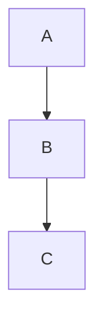

# felttrip.github.io

Source for [blog.felttrip.com](https://blog.felttrip.com) — a Jekyll site hosted on GitHub Pages.

## Prerequisites

- Ruby (check `.ruby-version` or use a version manager like `rbenv`)
- Bundler: `gem install bundler`

## Setup

```bash
bundle install
```

## Local development

```bash
make serve
```

This runs `bundle exec jekyll serve --baseurl="" --livereload --drafts`, which:
- Serves the site at [http://localhost:4000](http://localhost:4000)
- Reloads the browser on file changes
- Includes draft posts (files in `_drafts/`)

## Writing posts

Posts live in `_posts/` and follow the naming convention:

```
_posts/YYYY-MM-DD-post-title.md
```

Each post needs front matter at the top:

```yaml
---
layout: post
title: "Your Post Title"
date: YYYY-MM-DD
categories: category-name
description: "Optional short description for SEO and social sharing (160 chars max)"
image: /assets/images/your-post/cover.webp
---

Post content here...
```

- `description` — used for meta description, Open Graph, and Twitter Card. Falls back to the post excerpt if omitted.
- `image` — used for `og:image` and `twitter:image` social previews. Optional.

## Drafts

Save unfinished posts to `_drafts/` without a date in the filename:

```
_drafts/my-draft-post.md
```

Drafts appear locally when running `make serve` but are not published.

## Mermaid diagrams

Posts support [Mermaid](https://mermaid.js.org/) diagrams using fenced code blocks:

````markdown

````

Mermaid is loaded automatically on any page that contains a mermaid code block. No additional front matter or configuration is needed.

## Deploying

Push to the `master` branch. GitHub Pages builds and deploys automatically.

## Project structure

```
_config.yml       # Site settings (title, URL, etc.)
_posts/           # Published posts
_drafts/          # Unpublished drafts
_layouts/         # Page templates
_includes/        # Reusable HTML fragments
_sass/            # Stylesheets
assets/           # Images and other static files
pages/            # Static pages (about, etc.)
```
