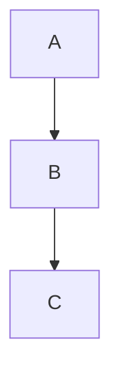

# felttrip.github.io

Source for [blog.felttrip.com](https://blog.felttrip.com) — a Hugo site hosted on GitHub Pages.

## Prerequisites

- [Hugo](https://gohugo.io/installation/) (extended edition — the site uses the SCSS asset pipeline)
- [Dart Sass](https://sass-lang.com/dart-sass/) — required by Hugo to compile SCSS

```bash
brew install hugo dart-sass
```

## Local development

```bash
make serve
```

This runs `hugo server --buildDrafts`, which:
- Serves the site at [http://localhost:1313](http://localhost:1313)
- Reloads the browser on file changes
- Includes any content marked `draft: true`

## Writing posts

Posts live in `content/posts/`, named after the post's slug (no date prefix — the date lives in front matter):

```
content/posts/post-title.md
```

This becomes `/posts/post-title/`. Each post needs front matter at the top:

```yaml
---
title: "Your Post Title"
date: YYYY-MM-DD
tags:
  - tag-name
description: "Optional short description for SEO and social sharing (160 chars max)"
image: /assets/images/your-post/cover.webp
---

Post content here...
```

- `description` — used for meta description, Open Graph, and Twitter Card. Falls back to the post summary if omitted.
- `image` — used for `og:image` and `twitter:image` social previews. Optional.

## Drafts

Unfinished notes live in `drafts/` at the repo root (outside `content/`, so Hugo never builds them) — same idea as Jekyll's `_drafts/`.

Alternatively, a post can live in `content/posts/` with `draft: true` in its front matter; it will show up locally with `make serve` but is excluded from `make build` / production builds.

## Mermaid diagrams

Posts support [Mermaid](https://mermaid.js.org/) diagrams using fenced code blocks:

````markdown

````

Mermaid is loaded automatically on every page. No additional front matter or configuration is needed.

## Deploying

Push to the `master` branch. GitHub Pages builds and deploys automatically via `.github/workflows/hugo.yml`.

## Project structure

```
hugo.toml         # Site settings (title, URL, taxonomies, etc.)
content/posts/    # Published posts
content/*.md      # Static pages (about, webring)
drafts/           # Unpublished draft notes (not built by Hugo)
layouts/          # Page templates and partials
assets/scss/      # Stylesheets (compiled via Hugo's asset pipeline)
static/           # Images, video, and other files served as-is
```
