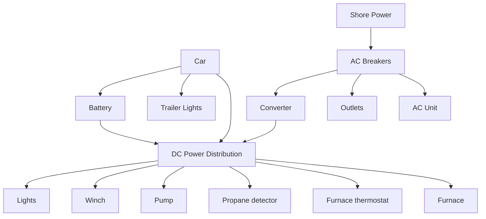

Last year we got a popup camper. It's been great for car camping with a kid, it's easy to tow, and still feels like you're camping because it's still tent adjacent. 

For some reason I don't have any pics of the popup itself from our last few trips, but here it is in front of the house fully set up. 

As far as RVs go it has a pretty simple electrical setup basically it's

We are usually dispersed camping, so having a power pedestal to plug into for shore power isn't happening. Having four dead outlets doesn't really bother me, but the giant AC unit on the roof thats going unused does. 

Because most of the popups electrical already runs off of DC, the solution I decided to go with was to replace the AC unit with a fan that runs on DC. That way I can still run it off of a battery if we need some airflow. 

## Fan Options
When doing research on fans there are basically two types of fans on the market. 

What I've been calling trap door fans

And this style that the brand Maxxair produces with an articulating hood.

Trap door fans are way cheaper, but you can't really run them in the rain. The Maxxair style fan is much nicer but more expensive, and had features that I didn't really care about, like a thermostat and a remote, for the model I wanted that had both intake and exhaust modes. 

I then stumbled upon what appeared to be the exact fan I wanted. The [Outprize Roof Vent Fan with Rain Shield](https://www.amazon.com/dp/B0GFCXZNGZ).

* Reasonably priced
* Reversable fan modes
* DC
* Maxxair style rain shield
* Manual controls

It's probably made in the same factory in China that the Maxxair fans are but with cheaper electrical components, which is fine by me. 

## Installation

### Exterior
First the AC unit in question. Poking around on the top of it I could see the ends of a couple of bolts that appeared to sandwich it to the roof. 

Coming back to the inside of the popup, it was fairly easy to pop the trim pieces off and see what was going on. Here we can see the four main bolts that are attaching the AC to the roof. I've also started disconnecting the power at this point. 

The bolts in question were comically long. I suppose if you wanted to mount this to something with a 2x6 framed roof you could. 

With the bolts removed, and a little bit of convincing the stuck adhesive that it was time to let go, the AC was able to get removed. Now we have a 14"x14" in the roof of the popup that needs to be filled ASAP.

A quick test fit of the fan to ensure we're not going to have issues, and everything lines up just how it needs to.

The fan didn't come with any installation instructions so I got creative using supplies I had on hand from installing the windows in the sauna.

First I used some waterproof flashing for the opening. The idea here was to protect the sandwich layers of the popup roof if there was leakage, and to also give a nice surface for the butyl tape to adhere to.

Next was a generous application of butyl tape to the perimeter of the fan. I wanted to make sure that edge to edge was covered, especially the screw holes. Once everything was tightened down it would squeeze out and I should have a solid waterproof seal. 

After seating the fan opening in the hole and screwing it down I trimmed off the excess flashing. I tried removing any excess silicone and foam from the ac that was left behind but I had concerns with damaging the roof and ended up leaving a good amount of it behind. 

Next I ran a bead of 264 elastomeric roof patch around the seams and then added a dollop on each screw head. Using a paintbrush I then spread the 264 around to ensure even coverage and to get around all the edges of the screws.

### Interior

With the exterior installed, it was time for the electrical. Originally I was planning on running the wires through the roof to one of the lights, but after removing the light the roof appears to be solid foam. Not wanting to mess too much with that I decided to run the wires straight across in a raceway to where the light sits.

The interior lights are each controlled with switches on them so the wires run to them are always carrying current. Using the light as a junction box and we splice the fan in. 

Drilling a small hole on the light allows the fan wires to exit. 

Next the interior trim portion needed to be cut down. Similarly to the AC unit you could install this on a timber framed roof with how much material they give you. For a popup I only needed 1.5".

The interior trim installs with four small screws. I then cut a small piece of raceway to hide the wires. 

Back to the roof we can see the final install with the vent opened to allow max airflow. 

Final install video. Both directions move plenty of air and can cool the popup plenty fast. 


Bonus is that now when towing I can see behind the popup, where previously my entire rear view was obscured by the AC unit.

